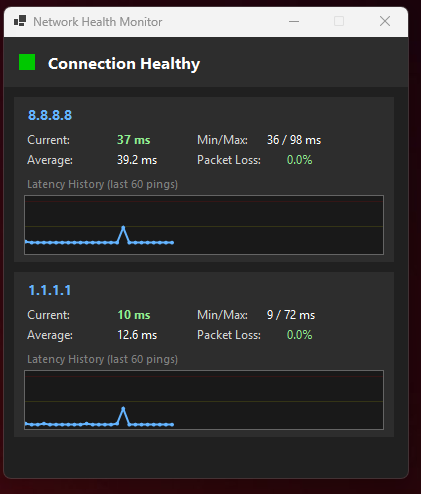

# Network Health Monitor

A lightweight Windows desktop widget that monitors network health by pinging Google DNS (8.8.8.8) and Cloudflare DNS (1.1.1.1).


## Features

- **Desktop widget** showing real-time latency and packet loss
- **Color-coded status indicator**:
  - Green: Healthy (< 100ms, 0% loss)
  - Yellow: Degraded (100-200ms or < 5% loss)
  - Red: Poor (> 200ms or > 5% loss)
- **Details window** with per-target breakdown and latency history graphs
- **System tray icon** for quick access
- **Draggable widget** - position anywhere on screen
- **Starts with Windows** (optional, via MSI installer)



## Installation

### Option 1: MSI Installer (Recommended)
Download `NetworkHealthMonitor.msi` from the [Releases](../../releases) page. Requires .NET 10 runtime.

### Option 2: Standalone Executable
Download `NetworkHealthMonitor.exe` from the [Releases](../../releases) page. No dependencies required (~111MB).

### Option 3: Framework-Dependent
Download `NetworkHealthMonitor-FrameworkDependent.zip` for a smaller package (~222KB). Requires [.NET 10 runtime](https://dotnet.microsoft.com/download/dotnet/10.0).

## Usage

- **Double-click widget** to open details window
- **Drag widget** to reposition
- **Right-click widget** for menu (Show Details, Snap to Taskbar, Hide, Exit)
- **System tray icon** provides backup access when widget is hidden

## Building from Source

```bash
# Clone the repository
git clone https://github.com/kotsaris/network-health-monitor.git
cd network-health-monitor

# Build
dotnet build

# Run
dotnet run

# Publish self-contained
dotnet publish -c Release -r win-x64 --self-contained -p:PublishSingleFile=true -o ./publish

# Publish framework-dependent
dotnet publish -c Release --no-self-contained -o ./publish-framework-dependent
```

## Requirements

- Windows 10/11
- .NET 10 runtime (for framework-dependent builds)

## License

[MIT](LICENSE)
